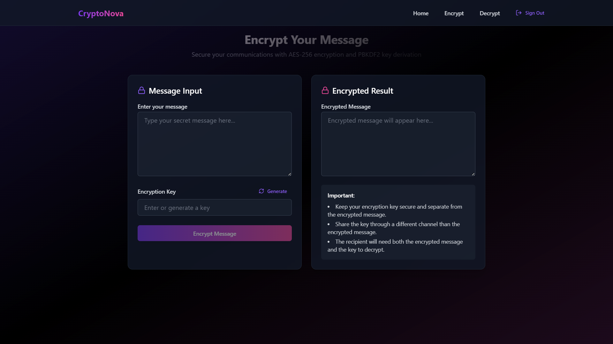

# 🚀 Next-Gen Message Encryptor & Decryptor  

## 🌌 Overview  
This project is a **futuristic, modern sci-fi** web application designed for **highly secure message encryption and decryption**. With a sleek **purple, black, and pink gradient UI**, smooth animations, and blockchain-powered encryption, this website ensures that your messages remain protected.  

## ✨ Features  
🔹 **Next-Gen Encryption & Decryption** – Utilizes cutting-edge cryptographic techniques and blockchain for added security.  
🔹 **Secure Key System** – Only the correct key can decrypt a message, making unauthorized access nearly impossible.  
🔹 **User Authentication** – Login, signup, and 'Forgot Password' functionality for a seamless user experience.  
🔹 **Stunning Sci-Fi UI** – Smooth animations, futuristic design, and interactive elements for an immersive feel.  
🔹 **Animated Icons** – Dynamic visuals enhance user interaction and experience.  

## 🔐 How It Works  
1. **Enter Your Message** – Type your text into the input field.  
2. **Encrypt** – Generate an encrypted version of your message along with a secure key.  
3. **Decrypt** – Input the encrypted message and the correct key to retrieve the original text.  
4. **Blockchain Security** – Ensures added layers of trust and decentralization.  

## 🛠️ Tech Stack  
- **Frontend:** React (Vite), TailwindCSS, Framer Motion 
- **Backend:** Node.js
- **Database:** Supabase
- **Encryption:** AES-256 Curve Cryptography 
- **Blockchain:** Hyperledger   

## 🚀 Installation & Setup  
1. **Clone the Repository:**  
   ```sh
   git clone https://github.com/Sudhaanshuu/CryptoNova.git
   cd CryptoNova
   ```

2. **Install Dependencies:**  
   ```sh
   npm install
   ```

3. **Set Up Environment Variables:**  
   Create a `.env` file in the root and add:  
   ```
   VITE_SUPABASE_URL=your-supabase-url
   VITE_SUPABASE_ANON_KEY=your-supabase-key
   ```

4. **Run the Development Server:**  
   ```sh
   npm run dev
   ```

## 📸 Screenshots  


## 📜 License  
This project is **open-source** under the MIT License.  

